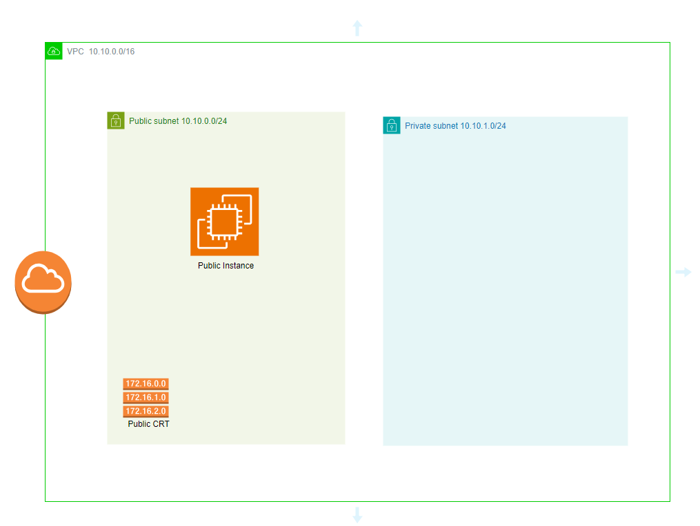

Esta arquitectura muestra una implementación básica en AWS con una VPC (Virtual Private Cloud), una subred pública, una subred privada y una instancia pública de EC2.

# Arquitectura Básica de EC2 en AWS

Este proyecto muestra una arquitectura básica en AWS utilizando **EC2** en una configuración con subred pública y privada dentro de una **VPC**. Esta es una buena base para aprender sobre redes virtuales y cómo manejar diferentes tipos de subredes en AWS. A continuación se describen los componentes y el propósito de esta arquitectura.

## Descripción de la Arquitectura 

### 1. **VPC (Virtual Private Cloud) - 10.10.0.0/16** ☁️
   - Se ha configurado una VPC con un rango de direcciones IP privadas `10.10.0.0/16`. Esta VPC actúa como la red principal en la que se implementan las subredes.

### 2. **Subred Pública - 10.10.0.0/24** 🌐
   - **Descripción**: Es una subred pública con el rango `10.10.0.0/24`. Los recursos dentro de esta subred pueden ser accesibles desde Internet.
   - **Instancia EC2 Pública**: Dentro de esta subred, hay una instancia pública de **EC2**, que puede servir como un servidor web o una puerta de enlace para recursos en subredes privadas.

### 3. **Subred Privada - 10.10.1.0/24** 🔒
   - **Descripción**: Esta subred privada, con el rango `10.10.1.0/24`, no tiene acceso directo a Internet. Los recursos aquí son internos y están protegidos, como bases de datos o servidores de aplicaciones.
   - **Uso**: Esta subred se puede utilizar para alojar recursos que no necesitan acceso directo a Internet pero que pueden ser accedidos a través de la instancia pública.

### 4. **Instancia EC2 Pública** 🖥️
   - Se ha desplegado una **Instancia EC2** en la subred pública. Esta instancia puede ser utilizada para conectarse a otras instancias o recursos que estén alojados en la subred privada.

### 5. **Direcciones CRT (Client Route Table)** 📡
   - Se muestran diferentes rutas `172.16.0.0`, `172.16.1.0`, y `172.16.2.0`, para permitir la conexión desde una red local o VPN hacia la subred pública. Estas son las tablas de ruta que permiten a las máquinas en la red pública saber cómo alcanzar ciertos rangos de IP.

## Beneficios de esta Arquitectura

- **Aislamiento de recursos**: La subred privada protege recursos críticos de accesos externos.
- **Control de tráfico**: El tráfico puede ser redirigido de manera controlada mediante la instancia pública EC2.
- **Escalabilidad**: Esta arquitectura puede ser expandida fácilmente, añadiendo más subredes, instancias EC2, o incluso otros servicios como RDS (bases de datos).

Con este diseño, se tiene una base sólida para implementar arquitecturas más complejas, como entornos de producción con balanceo de carga, grupos de escalado automático, o VPNs para acceso seguro.

### Diagrama de la Arquitectura:

Este tipo de estructura te ayudará a desarrollar y ampliar tus conocimientos en arquitectura en la nube con AWS. ¡Continúa personalizando y mejorando esta configuración para diferentes casos de uso!

